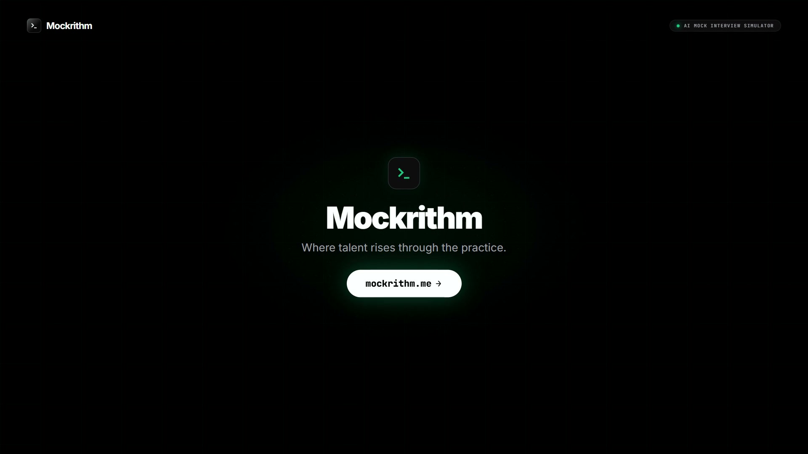

# Mockrithm

Mockrithm is a proprietary, enterprise-grade mock interview and interactive learning simulator. It is built to offer a sleek, premium experience for assessment, dynamic coding sandbox execution, and structured evaluation.

🌐 **Website**: [https://mockrithm.me](https://mockrithm.me)

---

## 🎬 Product Overview & Demo

> 📹 **[Watch the 20s Launch Video (1080p 60fps)](./brag-output/brag.mp4)**: Experience real-time conversational AI voice telemetry, live code execution, and interview readiness analytics in action.

---

**Note: This is a commercial product. The source code, prompts, assets, and design systems are proprietary and protected under copyright law.**

---

## 🛠️ Tech Stack

- **Framework**: Next.js 16 (React 19) with TypeScript
- **Voice STT**: Client-side VAD (Voice Activity Detection) + Whisper Large V3 Turbo (Groq API wrapper)
- **Voice TTS**: Microsoft Edge Neural TTS (Free, high-quality zero-cost API fallback)
- **State Management**: React Hook Form + Zod for validation, Context API for global state
- **Animations**: Framer Motion, GSAP
- **Authentication**: Clerk / Firebase Auth
- **Database**: Firestore (via Firebase Admin SDK)
- **AI Backend**: Dynamic Multi-Key API load-balancing (`fetchGroq`) with automated 429 and terms-acceptance rate-limit failovers.

---

## 🏁 Development Setup

### Prerequisites
- Node.js (v18+)
- npm (or yarn)

---

## 📄 License and Copyright

Copyright © 2026 Mockrithm. All rights reserved. 

Unauthorized copying, distribution, modification, or download of this software, via any medium, is strictly prohibited. This code is confidential and proprietary to the copyright holders.
